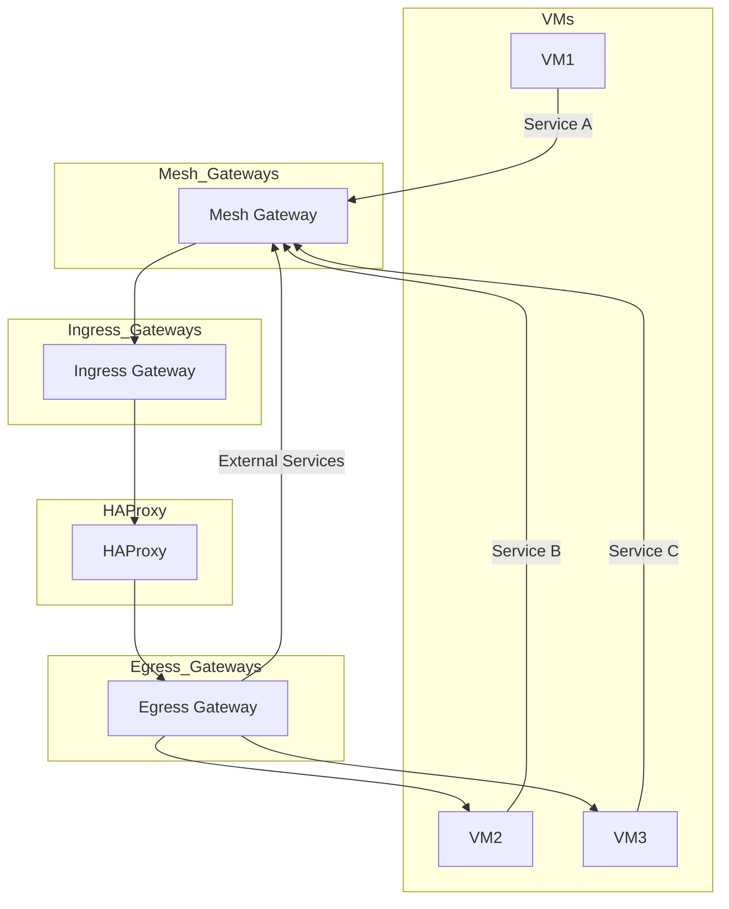

```mermaid
flowchart TD
    subgraph VMs
        VM1["VM1"]
        VM2["VM2"]
        VM3["VM3"]
    end
    subgraph Mesh_Gateways
        MeshGateway["Mesh Gateway"]
    end
    subgraph Ingress_Gateways
        IngressGateway["Ingress Gateway"]
    end
    subgraph Egress_Gateways
        EgressGateway["Egress Gateway"]
    end
    subgraph HAProxy
        HAProxyInstance["HAProxy"]
    end

    VM1 -->|"Service A"| MeshGateway
    VM2 -->|"Service B"| MeshGateway
    VM3 -->|"Service C"| MeshGateway
    MeshGateway --> IngressGateway
    IngressGateway --> HAProxyInstance
    HAProxyInstance --> EgressGateway
    EgressGateway --> VM2
    EgressGateway --> VM3
    EgressGateway -->|"External Services"| MeshGateway
```