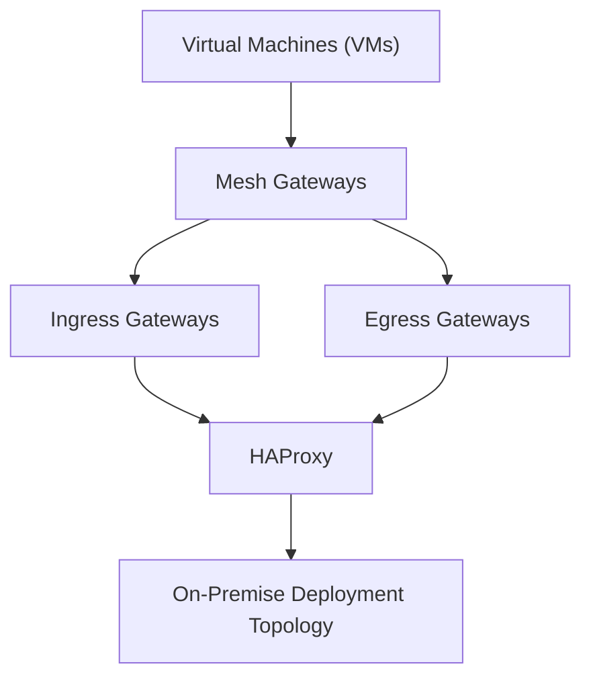

# Consul Enterprise Service Mesh Architecture

## Overview
This document provides a visual representation of the architecture of the Consul Enterprise Service Mesh. The diagram illustrates how different components such as VMs, Mesh Gateways, Ingress Gateways, Egress Gateways, and HAProxy interact within an on-premise deployment.
