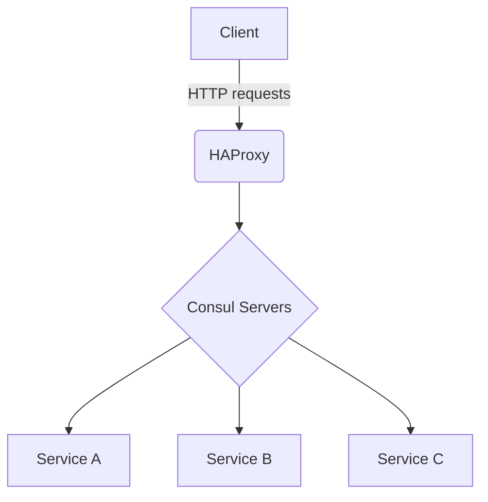
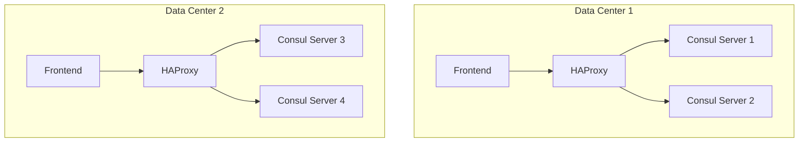

# On-Premise Deployment Topology

## Overview
This document provides a comprehensive overview of the on-premise deployment topology for the Consul Enterprise Mesh. It includes details about the network architecture, HAProxy setup, gateway deployments, and various Mermaid diagrams to visualize the overall structure.

## Network Architecture
- **Structure**: The network should be divided into multiple subnets to isolate different components.
- **Components**:
  - **Consul Servers**: Responsible for maintaining the state of the key-value store and service discovery.
  - **Consul Clients**: Node agents that run on every service, enabling communication with Consul Servers.
  - **HAProxy Load Balancer**: Distributes incoming traffic across the Consul Servers and gateways.

## HAProxy Setup
- **Purpose**: HAProxy is used to balance load between multiple Consul servers and ensure high availability.
- **Configuration**:
    
```haproxy
frontend consul_frontend
    bind *:80
    default_backend consul_backend

backend consul_backend
    balance roundrobin
    server consul1 192.168.1.2:8500 check
    server consul2 192.168.1.3:8500 check
    server consul3 192.168.1.4:8500 check
```  

## Gateway Deployments
- **Definitions**: Gateways serve as entry points into the mesh network.
- **Implementation Types**:
  - **Ingress Gateway**: Manages incoming requests from external clients.
  - **Egress Gateway**: Manages outgoing requests to external services.

## Deployment Scenarios
- **Single-Region Deployment**: All components are deployed within a single data center.
- **Multi-Region Deployment**: Components are deployed across multiple data centers with redundancy.

## Mermaid Diagrams
- **Architecture Diagram**:


- **Network Layout**:


## Conclusion
This document outlines the key components and configurations required for on-premise deployment of Consul Enterprise Mesh. Ensure that each component is thoroughly tested in your environment before production deployment.